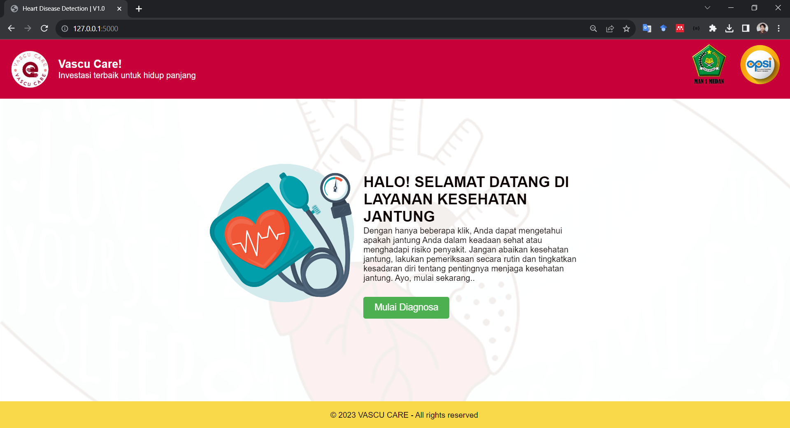
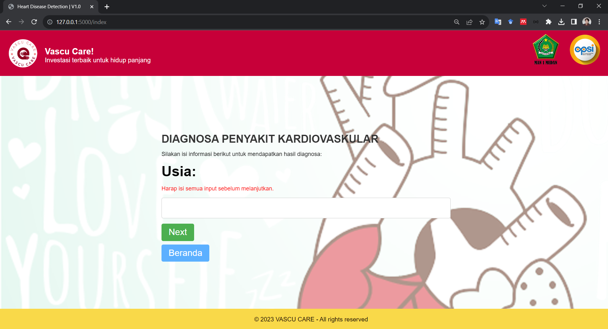
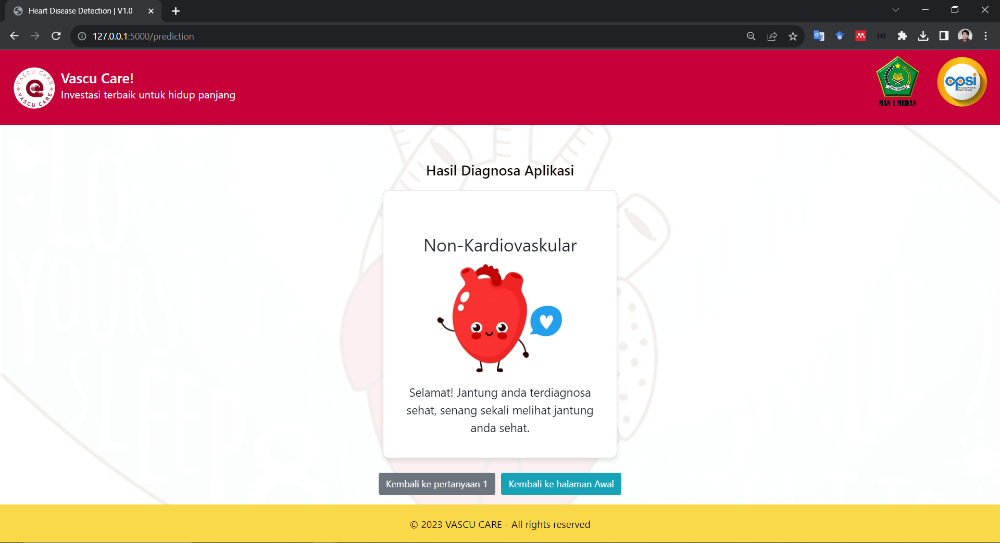
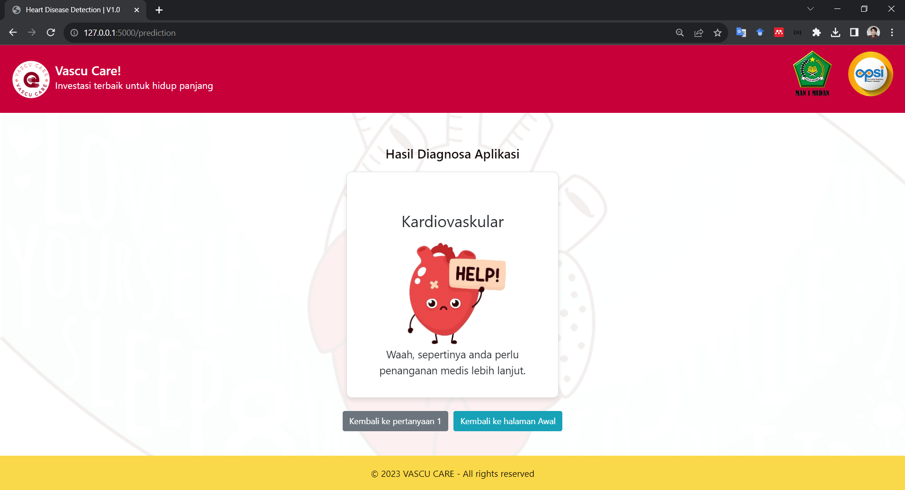

# Sistem Deteksi Penyakit Kardiovaskular
Sistem ini dibangun menggunakan bahasa pemrograman python dan model dilatih menggunakan XGBOOST.
Dataset pada program ini menggunakan Data Cleveland Heart Disease (https://www.kaggle.com/datasets/cherngs/heart-disease-cleveland-uci) yang sudah di cross-check dengan data aslinya (https://archive.ics.uci.edu/dataset/45/heart+disease)

# ScreenShot Web Apps :

## Halaman Utama

| Halaman Input | Halaman Hasil (0) | Halaman Hasil (1) |
|----------|----------|----------|
|  |  |  |
